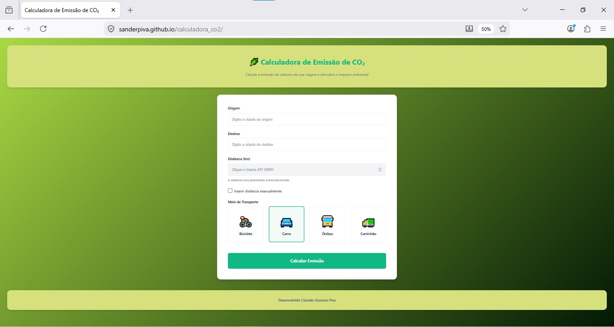
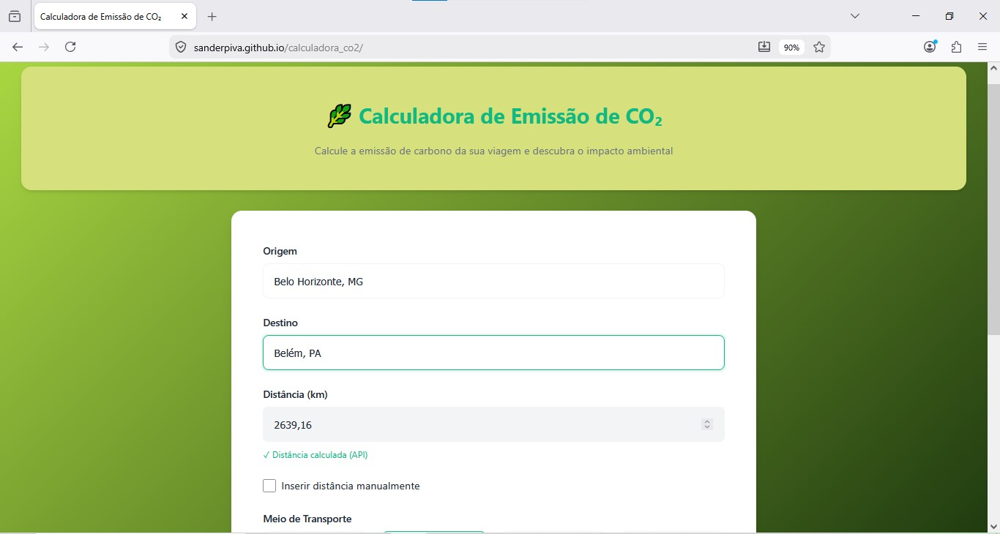
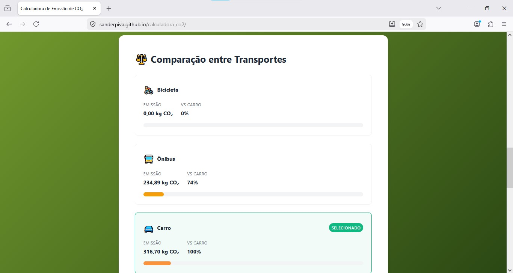
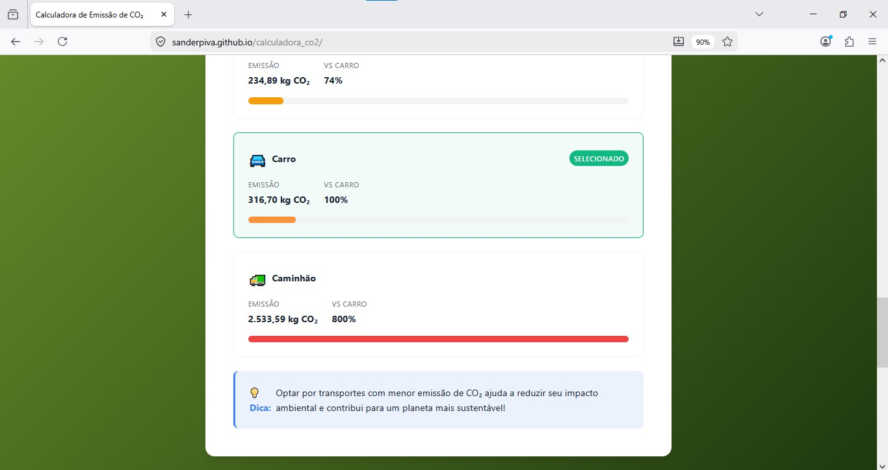
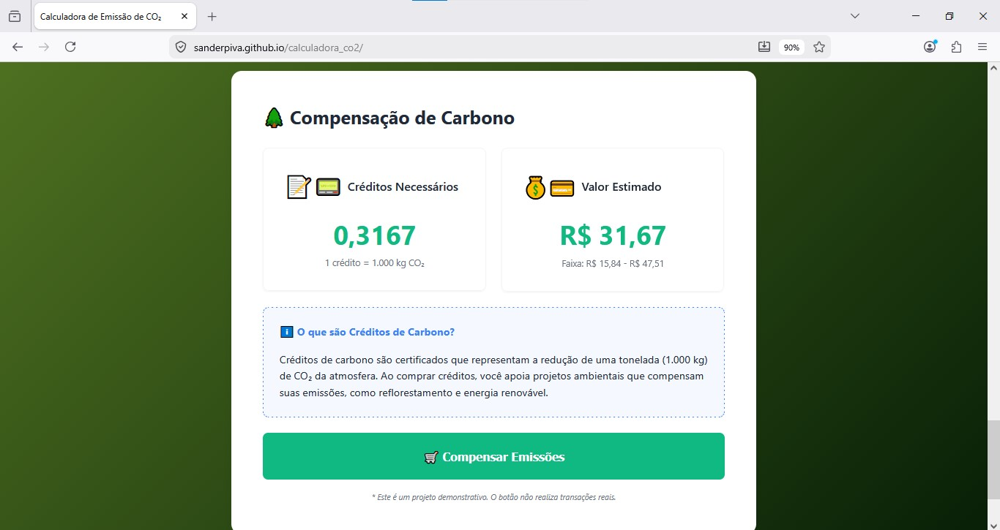
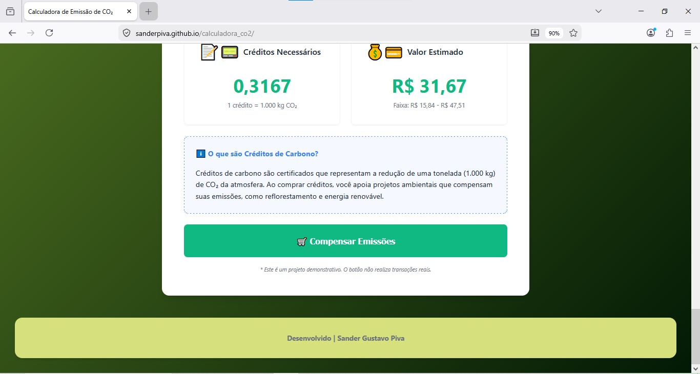

# 🌍 EcoTrip - Calculadora de Emissões de CO₂

## 📖 Definição

A **EcoTrip** é uma aplicação web interativa que simula o impacto ambiental de deslocamentos terrestres. O projeto utiliza dados geográficos reais para estimar a pegada de carbono (CO₂), permitindo que o usuário visualize o custo ecológico de suas viagens e tome decisões mais sustentáveis.

## 🎯 Objetivo

O projeto visa transformar dados técnicos ambientais em informações compreensíveis, ajudando o usuário a tomar decisões mais **conscientes** e **sustentáveis** em seus trajetos diários ou viagens de longa distância.

---

## 🛠️ Implementações Técnicas de Destaque

O projeto foi construído focando em **segurança de dados** e **reatividade**:

* **Integração API OSRM & Nominatim:** Cálculo de rotas reais baseadas em malha viária, substituindo distâncias estáticas por dados precisos de latitude e longitude.
* **Interface Reativa (UI/UX):** Implementação de um fluxo de "limpeza de palco". Ao interagir com os campos de busca, os resultados anteriores são ocultados automaticamente via classes CSS (`.hidden`), garantindo que o usuário nunca veja dados inconsistentes.
* **Validação de Input:** Verificação rigorosa no front-end e na lógica de processamento para impedir o cálculo de dados nulos, negativos ou inconsistentes.
* **Arquitetura Modular:** Separação clara de responsabilidades entre os arquivos JavaScript (Config, Calculator, UI e App), facilitando a manutenção e futuras expansões.

## 📂 Estrutura do Repositório

* `index.html`: Estrutura semântica e containers da aplicação.
* `css/style.css`: Estilização moderna e gerenciamento de estados visuais.
* `js/config.js`: Cérebro da integração com APIs e controle de autofill de distância.
* `js/calculator.js`: Motor de cálculo ambiental e financeiro (conversão para créditos de carbono).
* `js/ui.js`: Gerenciador de interface e renderização de componentes dinâmicos.
* `js/app.js`: Inicializador global e orquestrador de eventos de submissão.

---

## 📸 Demonstração e Resultados

Para ver a **EcoTrip** em ação, assista ao vídeo demonstrativo abaixo:

https://youtu.be/pXgWW9I5wOI

### 🔗 Link da Página Web EcoTrip - Calculadora de Emissões de CO₂

🚀 **[Teste a aplicação aqui](https://sanderpiva.github.io/calculadora_co2/)**

---

### Screenshots do Sistema

#### 1. Tela Principal e Busca de Rotas

*Interface limpa com integração de busca automática de cidades.*

#### 2. Inserção automática (API OSRM) ou manual da distância

*Sistema permite o uso da API OSRM para obtenção da distância ou inserção manual.*

#### 3. Resultados e Comparativos

*Exibição das emissões em kg de CO₂ e equivalência em Créditos de Carbono.*

---

**Autor:** Sander Gustavo Piva  
*Desenvolvedor focado em soluções tecnológicas para sustentabilidade e análise de dados.*
